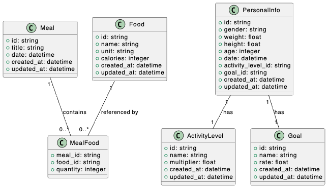

# Especificação do Projeto

Este documento define a especificação do MVP para a aplicação Total Fitness Tracker (TFT), um sistema voltado para o registro e monitoramento de informações relacionadas à dieta e à evolução das medidas corporais. O objetivo principal da aplicação é fornecer um ambiente prático e eficiente para que o usuário possa registrar suas refeições, acompanhar seu peso e definir metas, permitindo um melhor controle de sua saúde e alimentação.

## Premissas do Projeto

- A aplicação deve permitir o registro completo de informações alimentares, possibilitando um cálculo preciso de calorias e macronutrientes para que o usuário possa compreender e controlar sua dieta.

- O sistema deve armazenar um histórico de pesagens do usuário, permitindo o acompanhamento da evolução de seu peso ao longo do tempo.

- Deve ser possível estabelecer metas calóricas para que o usuário possa visualizar seu progresso e avaliar seu desempenho em relação às metas estabelecidas.

- A interface da aplicação deve ser intuitiva e oferecer estatísticas relevantes para o usuário, permitindo uma melhor compreensão de sua evolução.

- No futuro, será incluído um módulo para registro de atividades físicas, possibilitando a contabilização do gasto calórico associado aos exercícios e sua interação com a dieta.

## Requisitos Funcionais

### RF001 - Registro de Refeições

Descrição: O sistema deve permitir que o usuário registre refeições, associando múltiplos alimentos a uma data específica.

Critérios de Aceitação:

- O usuário pode adicionar uma refeição informando a data e os alimentos consumidos.

- Cada alimento deve conter nome, quantidade e calorias correspondentes.

- Deve ser possível visualizar todas as refeições registradas.

### RF002 - Cadastro de Alimentos

Descrição: O sistema deve manter um banco de alimentos cadastrados, permitindo que o usuário os selecione ao registrar uma refeição.

Critérios de Aceitação:

- Cada alimento deve possuir nome, quantidade padrão e calorias por porção.

- O usuário pode selecionar um alimento e especificar a quantidade ao adicioná-lo a uma refeição.

- O sistema deve calcular automaticamente as calorias totais com base na quantidade informada.

### RF003 - Histórico de Pesagem

Descrição: O sistema deve permitir que o usuário registre seu peso periodicamente e visualizar o histórico de pesagens.

Critérios de Aceitação:

- O usuário pode registrar pesagens informando a data e o peso em quilogramas.

- O sistema deve armazenar todas as pesagens registradas.

- O usuário pode consultar um histórico de pesagens anteriores.

### RF004 - Definição de Meta Calórica

Descrição: O sistema deve permitir que o usuário defina uma meta calórica diária e armazenar um histórico de metas anteriores.

Critérios de Aceitação:

- O usuário pode definir uma meta calórica diária.

- O sistema deve manter um histórico das metas estabelecidas.

### RF005 - Registro do Nível de Atividade Física

Descrição: O sistema deve permitir que o usuário registre seu nível de atividade física e armazenar um histórico dessas informações.

Critérios de Aceitação:

- O usuário pode selecionar um nível de atividade física.

- O sistema deve armazenar a data de cada alteração do nível de atividade física.

- O histórico deve ser acessível para consulta posterior.

### RF006 - Estatísticas Básicas

Descrição: O sistema deve calcular e exibir informações sobre o consumo calórico diário e sua relação com a meta calórica estabelecida.

Critérios de Aceitação:

- O sistema deve exibir a quantidade total de calorias consumidas no dia.

- O sistema deve comparar o consumo diário com a meta calórica e apresentar a diferença.

- Deve ser possível visualizar estatísticas de dias anteriores.

## Diagrama de Entidade-Relacionamento

O diagrama a seguir representa a estrutura de entidades e seus relacionamentos.

